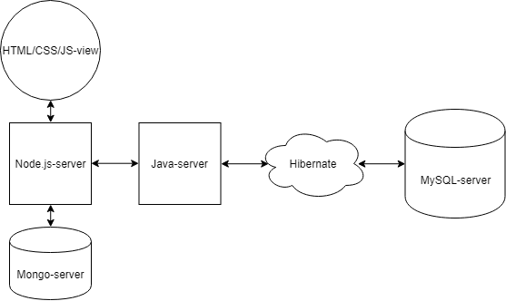
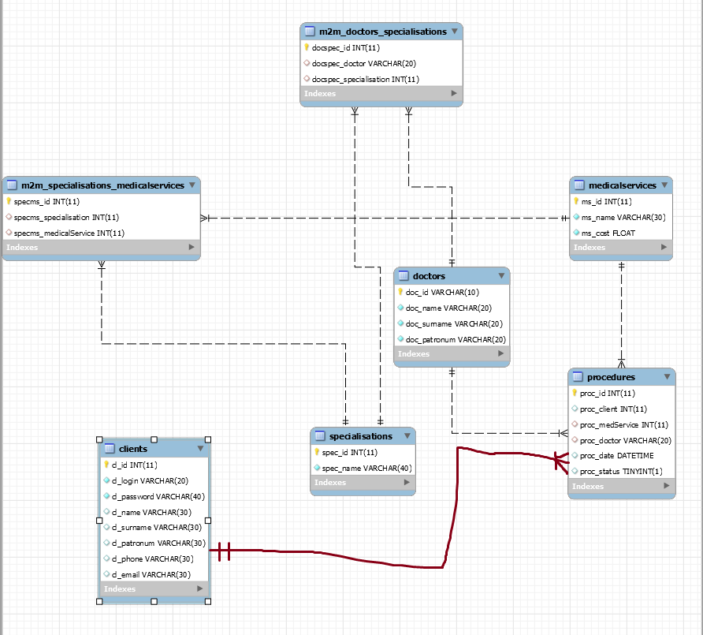

# Ветеринарная клиника и немного аниме!

Основная задача этого приложения - запись пользователя на приём в клинику. Остальные функции приложения призваны помочь пользователю собрать
необходимую информацию и сделать заказ.

## Архитектура

Элемент|Функция
:--------|:-------:
HTML/CSS/JS|Страницы сайта
Node.js|Сервер, на котором развёрнут сайт. При обращении к определённому URL (переход по ссылке) возвращает соответствующую страницу. Кроме этого отвечает за выполнение сложных запросов на Java-сервер, рендеринг шаблонов и получение информации из MongoDB.
Mongo| Вспомогательная база данных. Используется для хранения информации, непригодной для хранения в реляционной БД (дополнительная информация, картинки и т.д)
Java| Сервер, выполняющий основные бизнес-функции приложения. При получении запроса, обрабатывает его, выполняет соответствущие операции и отправляет назад результат
Hibernate| Прослойка объектов между Java-сервером и реляционной БД (hibernate-класс === SQL-таблица). Призвана упрощать работу с базой данных
MySQL| Реляционная БД с основной информацией приложения

## База данных

Базы данных две - реляционная(основная) и документоориентированная(вспомогательная). Ниже представлена схема реляционной БД.

Таблица|Описание
:------|--------:
doctors|Таблица с основной информацией о врачах клиники - полное имя и id
specialisations|Таблица с содержащая специализации врачей - название и id
medicalServices|Таблица с услугами, которая предоставляет клиника - название, цена и id
clients|Таблица с информацией о клиентах - полное имя, логин, пароль, телефон, email и id
procedures|Таблица с информацией о запланированных процедурах ветклиники - клиент, услуга, доктор, время, статус и id

Документоориентированная БД содержит две коллекции - отзывы пользователей (в случае ошибки) и дополнительную информацию о врачах.

## Варианты использования

1. Авторизация
2. Регистация
3. Просмотр заказов за всё время
4. Изменение статуса заказа
5. Быстрый поиск услуг
6. Быстрый заказ услуги
7. Просмотр информации о врачах
8. Репортинг ошибок
9. Изменение статуса пользователя
10. Сохранение отзыва о докторе
11. Проверка статуса доктора при выборе